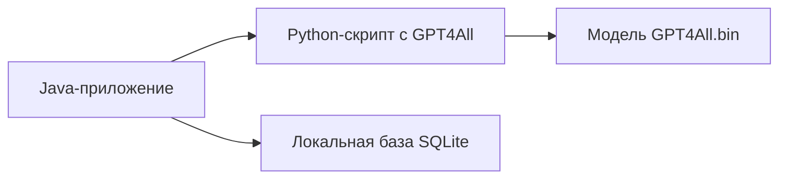

### **GPT4All для концепт-приложения: простое и эффективное решение**

Для вашего учебного концепта на Java, где важны **простота интеграции**, **бесплатность** и **демонстрация возможностей ИИ**, GPT4All — идеальный выбор. Вот как это будет работать:

---

#### **1. Минималистичная архитектура**

- **Java**: Интерфейс и логика приложения.
- **Python**: Обёртка для работы с GPT4All (вызов через `Runtime.getRuntime().exec()`).
- **Модель**: Файл `gpt4all-lora-quantized.bin` (4 ГБ) в папке проекта.
- **База данных**: SQLite для хранения расписания и задач.

---

#### **2. Какие функции покроет GPT4All?**
| Функция приложения | Как реализовать |
|--------------------|----------------|
| **Краткие конспекты** | Передавать текст лекции в модель, запрашивать суммаризацию. |
| **Генерация вопросов** | Запрос: "Создай 5 вопросов по теме: {тема}". |
| **Объяснение сложных тем** | "Объясни теорию относительности простыми словами". |
| **Подсказки по тайм-менеджменту** | Анализ списка задач + генерация советов. |

**Пример запроса на Python**:
```python
from gpt4all import GPT4All
model = GPT4All("gpt4all-lora-quantized.bin")
response = model.generate("Создай конспект из текста: {текст_лекции}", max_tokens=150)
print(response)
```

---

#### **3. Пошаговая интеграция для демо**
1. **Скачайте модель** (4 ГБ):
   ```bash
   wget https://gpt4all.io/models/gpt4all-lora-quantized.bin -P ./models/
   ```

2. **Напишите Python-скрипт** (`gpt_helper.py`):
   ```python
   import sys
   from gpt4all import GPT4All
   model = GPT4All("./models/gpt4all-lora-quantized.bin")
   query = sys.argv[1]  # Получаем запрос из Java
   print(model.generate(query, max_tokens=200))
   ```

3. **Вызов из Java**:
   ```java
   import java.io.BufferedReader;
   import java.io.InputStreamReader;

   public class GPT4AllClient {
       public static String askGPT(String question) throws Exception {
           Process p = Runtime.getRuntime().exec("python gpt_helper.py \"" + question + "\"");
           BufferedReader reader = new BufferedReader(new InputStreamReader(p.getInputStream()));
           return reader.readLine();
       }
   }
   ```

4. **Пример использования**:
   ```java
   String answer = GPT4AllClient.askGPT("Сгенерируй 3 вопроса по Java-программированию");
   System.out.println(answer);
   ```

---

#### **4. Что показывать в презентации?**
1. **Оффлайн-работа**:
   - Запустите приложение без интернета.
   - Продемонстрируйте генерацию конспекта из текста.

2. **Скорость**:
   - На слабом ноутбуке: ~3-5 сек на ответ.

3. **Пример вывода**:
   ```
   Вопросы по Java:
   1. Что такое полиморфизм?
   2. Как работает сборщик мусора?
   3. В чём разница между ArrayList и LinkedList?
   ```

---

#### **5. Ограничения и обходные пути**
| Проблема | Решение для концепта |
|----------|----------------------|
| Слабый русский | Используйте простые английские запросы + перевод (Google Translate API). |
| Нет GPU | Выберите модель `gpt4all-lora-quantized` — работает на CPU. |
| Задержки | Добавьте анимацию загрузки в интерфейсе. |

---

#### **6. Альтернативы для самых смелых**
Если хочется большего:
1. **LocalAI** (легковесный сервер):
   ```bash
   docker run -p 8080:8080 -v ./models:/models localai/localai
   ```
   - Запросы через REST API из Java.

2. **Hugging Face Transformers**:
   - Модель `LaMini-Flan-T5` (2 ГБ) с поддержкой русского.

---

### **Итог**
GPT4All позволяет за 2 часа реализовать:
- Локальный ИИ-ассистент без API-ключей.
- Генерацию учебных материалов.
- Демонстрацию работы NLP в offline.

Для концепта этого более чем достаточно! Код можно упаковать в один ZIP-архив с моделью и скриптами — будет работать на любом ПК.
