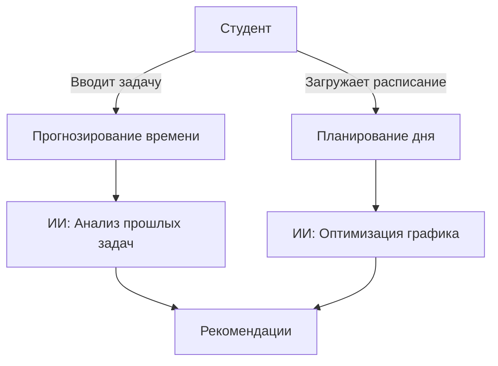

### **Таблица 1. Use Case "Автоматическое планирование дня"**
| **Поле**               | **Описание** |
|------------------------|-------------|
| **Название**           | Планирование задач на основе расписания |
| **Участники**          | Студент (основной), ИИ-система (второстепенный) |
| **Предусловие**        | 1. Расписание занятий загружено. 2. Список задач добавлен. |
| **Триггер**            | Пользователь нажимает кнопку **«Оптимизировать день»**. |
| **Основной сценарий**  | 1. ИИ анализирует:    - Временные «окна» между занятиями.    - Приоритет задач (дедлайны, сложность). 2. Система предлагает график:    *«14:00-15:30 — написание реферата (высокий приоритет)»*. 3. Пользователь подтверждает или корректирует план. |
| **Альтернативный сценарий** | 1.1. Если задач слишком много:    - ИИ предлагает перенести часть на другой день. 3.1. Если пользователь отклоняет план:    - Система сохраняет ручные изменения для анализа в будущем. |
| **Результат**          | Сформирован персональный график с напоминаниями. |

---

### **Таблица 2. Use Case "Прогнозирование времени для задачи"**
| **Поле**               | **Описание** |
|------------------------|-------------|
| **Название**           | Оценка времени выполнения задачи |
| **Участники**          | Студент, ИИ-система |
| **Предусловие**        | Пользователь добавил ≥1 задачу ранее. |
| **Триггер**            | Ввод новой задачи: *«Подготовить презентацию»*. |
| **Основной сценарий**  | 1. ИИ сравнивает с похожими прошлыми задачами. 2. Оценивает сложность (по ключевым словам, объему). 3. Выводит:    *«На это уйдет ~4 часа. Начни за 2 дня до дедлайна»*. |
| **Альтернативный сценарий** | 1.1. Если это первая задача такого типа:    - Использует средние значения по другим пользователям. |
| **Результат**          | Пользователь получает реалистичный срок для выполнения. |

---

### **Таблица 3. Use Case "Генерация вопросов для самопроверки"**
| **Поле**               | **Описание** |
|------------------------|-------------|
| **Название**           | Создание теста на основе конспектов |
| **Участники**          | Студент, ИИ-система |
| **Предусловие**        | Загружен ≥1 учебный материал. |
| **Триггер**            | Нажатие кнопки **«Сгенерировать тест»**. |
| **Основной сценарий**  | 1. ИИ выделяет ключевые термины из конспектов. 2. Формирует вопросы:    - *«Что такое фотосинтез?»*    - *«Решите уравнение: 2x + 5 = 15»*. 3. Проверяет ответы и дает обратную связь. |
| **Альтернативный сценарий** | 1.1. Если материалов недостаточно:    - Предлагает загрузить дополнительные файлы. |
| **Результат**          | Пользователь получает персонализированный тест для проверки знаний. |

---

### **Таблица 4. Use Case "Рекомендации по улучшению обучения"**
| **Поле**               | **Описание** |
|------------------------|-------------|
| **Название**           | Анализ слабых мест в обучении |
| **Участники**          | Студент, ИИ-система |
| **Предусловие**        | Пользователь регулярно отмечает выполненные задачи/тесты. |
| **Триггер**            | Еженедельный автоматический анализ. |
| **Основной сценарий**  | 1. ИИ выявляет темы с низкой успеваемостью. 2. Отправляет рекомендации:    *«Повтори: 1) Интегралы, 2) Дифференциальные уравнения»*. 3. Прикрепляет ссылки на материалы. |
| **Альтернативный сценарий** | 2.1. Если пользователь не согласен:    - Позволяет отметить тему как усвоенную. |
| **Результат**          | Персонализированный план для улучшения знаний. |

---

### **Диаграмма связей (пример для UC1 и UC2)**  

